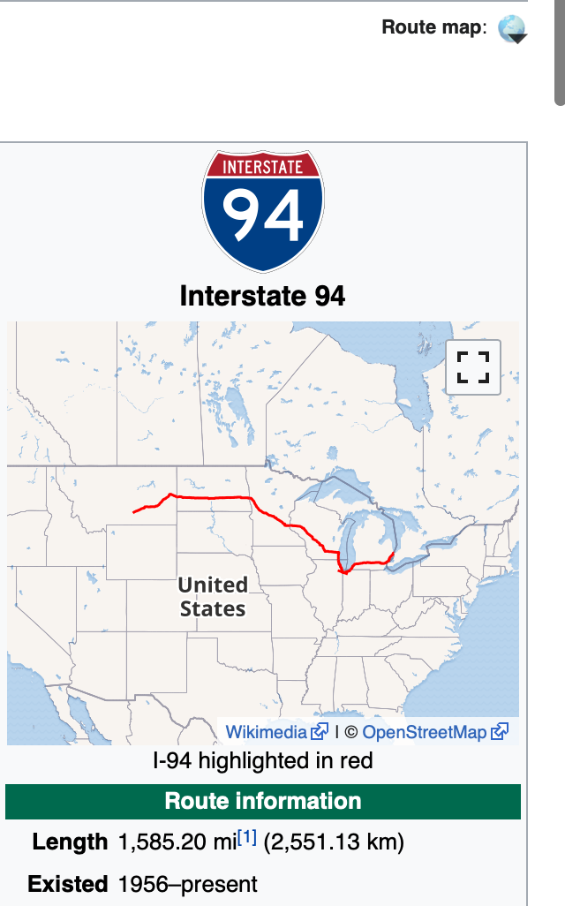

 [![Contributors][contributors-shield]][contributors-url] [![Forks][forks-shield]][forks-url] [![Stargazers][stars-shield]][stars-url] [![Issues][issues-shield]][issues-url] [![MIT License][license-shield]][license-url] [![LinkedIn][linkedin-shield]][linkedin-url]
 <!-- MARKDOWN LINKS & IMAGES -->
<!-- https://www.markdownguide.org/basic-syntax/#reference-style-links -->

[contributors-shield]: https://img.shields.io/github/contributors/AvinashBolleddula/Exploring-Hackers-News-Posts.svg?style=flat-square
[contributors-url]: https://github.com/AvinashBolleddula/Finding-Heavy-Traffic-Indicators-on-I-94/graphs/contributors
[forks-shield]: https://img.shields.io/github/forks/AvinashBolleddula/Finding-Heavy-Traffic-Indicators-on-I-94.svg?style=flat-square
[forks-url]: https://github.com/AvinashBolleddula/Finding-Heavy-Traffic-Indicators-on-I-94/network/members
[stars-shield]: https://img.shields.io/github/stars/AvinashBolleddula/Finding-Heavy-Traffic-Indicators-on-I-94.svg?style=flat-square
[stars-url]: https://github.com/AvinashBolleddula/Finding-Heavy-Traffic-Indicators-on-I-94/stargazers
[issues-shield]: https://img.shields.io/github/issues/AvinashBolleddula/Finding-Heavy-Traffic-Indicators-on-I-94.svg?style=flat-square
[issues-url]: https://github.com/AvinashBolleddula/Finding-Heavy-Traffic-Indicators-on-I-94/issues
[license-shield]: https://img.shields.io/badge/License-MIT-yellow.svg
[license-url]: https://github.com/AvinashBolleddula/Finding-Heavy-Traffic-Indicators-on-I-94/blob/master/LICENSE
[linkedin-shield]: https://img.shields.io/badge/-LinkedIn-black.svg?style=flat-square&logo=linkedin&colorB=555
[linkedin-url]: https://linkedin.com/in/avinashbolleddula
[product-screenshot]: images/screenshot.jpg

<!-- PROJECT LOGO -->
<br />

<p align="center">
 <a href="https://github.com/AvinashBolleddula/Finding-Heavy-Traffic-Indicators-on-I-94">
  
 </a>
 <h3 align="center">Finding-Heavy-Traffic-Indicators-on-I-94.</h3>
 <p align="center">

  <br />
  <a href=https://github.com/AvinashBolleddula/Finding-Heavy-Traffic-Indicators-on-I-94><strong>Explore the repository»</strong></a>
  <br />
  <br />
 </p>


</p>

> Python,Data Analysis,Data Cleaning


<!-- ABOUT THE PROJECT -->

## About The Project

In this project, we're going to analyze a dataset about the westbound traffic on the [I-94 Interstate highway](https://en.wikipedia.org/wiki/Interstate_94).<br>The goal of our analysis is to determine a few indicators of heavy traffic on I-94. These indicators can be weather type, time of the day, time of the week, etc.


### Built With

* python,Pandas,NumPy,Matplotlib


### Dataset

John Hogue made the dataset available that we'll be working with, and you can download it from the [UCI Machine Learning Repository](https://archive.ics.uci.edu/ml/datasets/Metro+Interstate+Traffic+Volume).

## Project structure

Files in this repository:

|     File / Folder      |                         Description                          |
| :--------------------: | :----------------------------------------------------------: |
| i94.png|  i94  Image  |
| Metro_Interstate_Traffic_Volume.csv         |John Hogue made the dataset available that we'll be working with, and you can download it from the [UCI Machine Learning Repository](https://archive.ics.uci.edu/ml/datasets/Metro+Interstate+Traffic+Volume).|
| Indicators of Heavy Traffic on I-94.ipynb     | Analysis to determine a few indicators of heavy traffic on I-94. These indicators can be weather type, time of the day, time of the week, etc. |
|         README         |                         Readme file                          |


<!-- GETTING STARTED -->

## Getting Started

Clone the repository into a local machine using

```sh
git clone https://github.com/AvinashBolleddula/Finding-Heavy-Traffic-Indicators-on-I-94
```

### Prerequisites

These are the prerequisites to run the program.

* python 3.8.3,Pandas,NumPy,Matplotlib


<!-- CONTACT -->

## Contact

Avinash B - avinash.bolleddula@gmail.com

Project Link: [https://github.com/AvinashBolleddula/Finding-Heavy-Traffic-Indicators-on-I-94](https://github.com/AvinashBolleddula/Finding-Heavy-Traffic-Indicators-on-I-94)
